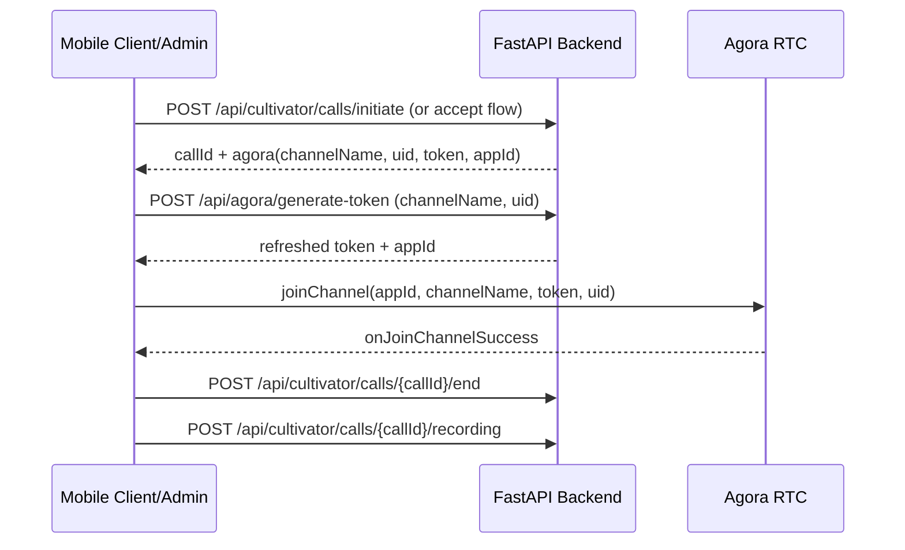

# Smart Agri Agora Integration Report

## Scope
This integration was completed with a non-redesign approach, reusing the existing Agora implementation patterns from `_cultivator_intention_analyzer` and only adding missing backend/frontend integration points.

## Phase 1: Existing Implementation Analysis

### Source of truth reviewed
- `_cultivator_intention_analyzer/frontend/hooks/useAgora.ts`
- `_cultivator_intention_analyzer/frontend/screens/AdminCallScreen.tsx`
- `_cultivator_intention_analyzer/frontend/screens/ClientCallScreen.tsx`
- `_cultivator_intention_analyzer/frontend/screens/IncomingCallScreen.tsx`
- `backend/cultivator/services/agora.py`
- `backend/cultivator/api/v1/endpoints/calls.py`

### Confirmed behavior model
- Channel lifecycle is backend-orchestrated through call APIs (`initiate`, `accept`, `end`), with Agora token/channel/uid returned per call.
- UIDs are deterministic integers provided by backend call flow.
- Recording flow is hybrid:
  - Client-side local recording via Agora SDK in `useAgora`.
  - Optional backend/cloud recording endpoints exist in call APIs.
- Token expectations:
  - Call flows already provide token in `agora` payload.
  - Additional safe token refresh before join improves resilience near token expiry.

## Phase 2: Backend Token Endpoint

### Added endpoint
- File added: `backend/agora_service.py`
- Endpoint: `POST /api/agora/generate-token`
- Auth: requires bearer token via `require_auth`
- Request payload:
  - `channelName: string`
  - `uid: int`
  - `role: "publisher" | "subscriber"` (default `publisher`)
- Response payload:
  - `token`
  - `appId`
  - `uid`
  - `channelName`
  - `expiresIn`

### Router registration
- Updated: `backend/idle_land_api.py`
- Added `app.include_router(agora_router)`

## Phase 3: Environment and Config Wiring

### Backend config aliases
- Updated: `backend/cultivator/core/config.py`
- Added alias support:
  - `agora_app_id` accepts `AGORA_APP_ID` and `agora_app_id`
  - `agora_app_certificate` accepts `AGORA_CERT`, `AGORA_APP_CERTIFICATE`, and `agora_app_certificate`

### Backend env files
- Updated: `backend/.env`
- Updated: `backend/.env.example`
- Added keys:
  - `AGORA_APP_ID`
  - `AGORA_CERT`

### Frontend env exposure
- Updated: `frontend/src/config.ts`
- Added:
  - `EXPO_PUBLIC_AGORA_APP_ID`

## Phase 4: Frontend API and Screen Integration

### Repaired and unified cultivator API client
- Rewritten: `frontend/src/api/cultivatorApi.ts`
- Key fixes:
  - Removed syntax corruption and restored valid TypeScript.
  - Preserved AsyncStorage auth behavior (`smartagri_token`, `smartagri_user`).
  - Added `getAgoraToken(channelName, uid, role)` targeting `/api/agora/generate-token`.
  - Kept existing call/interview/explain/recording methods aligned with current app routes.

### Call screen updates
- Updated: `frontend/app/cultivator/admin/call.tsx`
- Updated: `frontend/app/cultivator/client/call.tsx`
- Updated: `frontend/app/cultivator/incoming-call.tsx`

Implemented changes:
- Fixed import paths to main app API/hook locations.
- Added pre-join token refresh (`getAgoraToken`) in admin/client call screens.
- Added Agora App ID fallback via `EXPO_PUBLIC_AGORA_APP_ID` when missing from call payload.
- Corrected interval ref typing for React Native/TypeScript compatibility.

## Phase 5: End-to-End Flow Consistency Check

### Expected flow (post integration)
1. Client/admin call initiation through `/api/cultivator/calls/*`.
2. Backend provides initial Agora payload (`appId/channelName/token/uid`).
3. Before join, frontend attempts token refresh via `/api/agora/generate-token`.
4. Frontend joins Agora channel using refreshed token if available; falls back to call token if refresh fails.
5. Call ends via backend end endpoint.
6. Recording upload and analysis flow remains unchanged.

### Sequence diagram

## Phase 6: Compatibility and Safety Checks

### Verified
- Touched files report no file-level compile/lint errors in editor checks.
- Single API service instance export remains intact (`cultivatorApi`).
- Auth storage behavior unchanged.
- No duplicate Agora engine creation patterns were introduced in modified call screens.
- Token expiry resilience improved by pre-join refresh attempt.

### Important runtime note
- Source-level verification confirms route registration in current code:
  - `idle_land_api` route table includes `/api/agora/generate-token`.
- The currently running backend process at `http://127.0.0.1:8000` still shows an older OpenAPI route set without `/api/agora/generate-token`.
- Action required: restart backend process to load latest router changes.

## Modified Files Summary

### Backend
- `backend/agora_service.py` (new)
- `backend/idle_land_api.py`
- `backend/cultivator/core/config.py`
- `backend/.env`
- `backend/.env.example`

### Frontend
- `frontend/src/config.ts`
- `frontend/src/api/cultivatorApi.ts`
- `frontend/app/cultivator/admin/call.tsx`
- `frontend/app/cultivator/client/call.tsx`
- `frontend/app/cultivator/incoming-call.tsx`

## Final Status
- Integration implementation: complete.
- Source-level route and compile integrity: complete.
- Runtime verification on active backend process: pending backend restart.

## Remaining TODOs
1. Restart backend (`run-backend.ps1`) and re-check `/openapi.json` for `/api/agora/generate-token`.
2. Execute one real device call (admin + client) to confirm full token-refresh join path.
3. Validate recording upload and post-call analysis response under normal network and one degraded network scenario.
